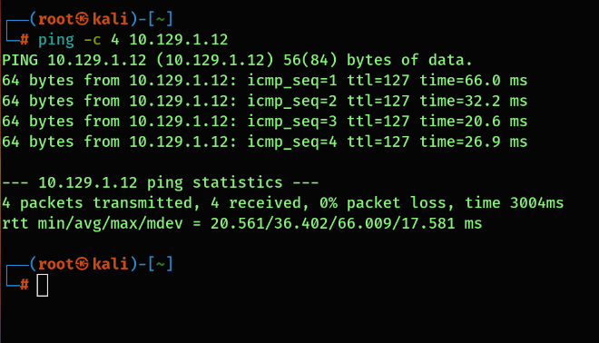
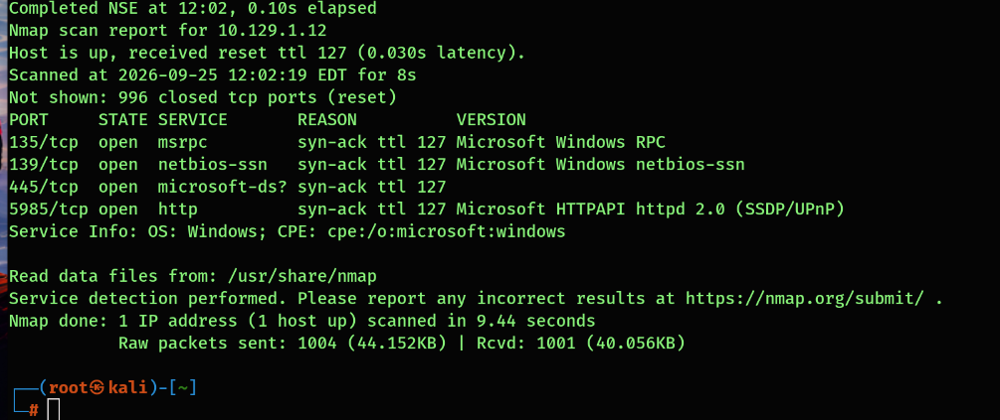
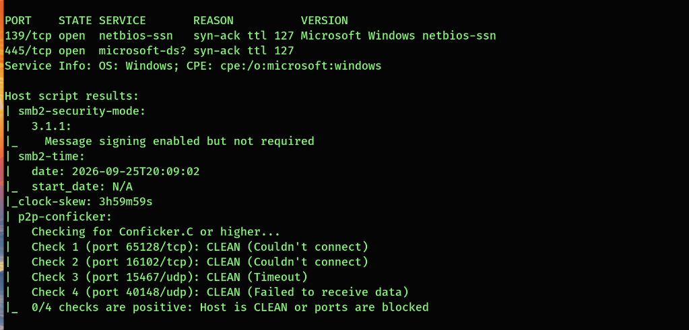
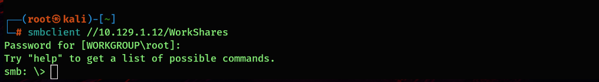
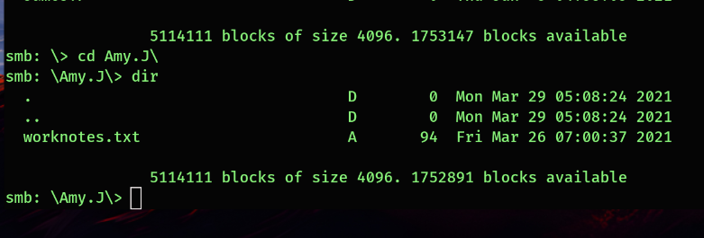
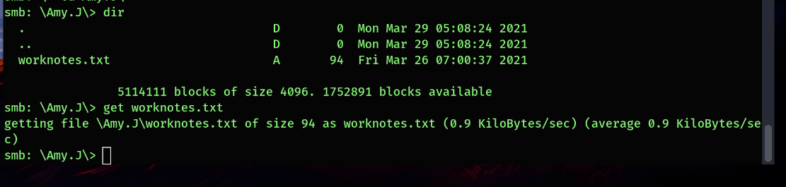
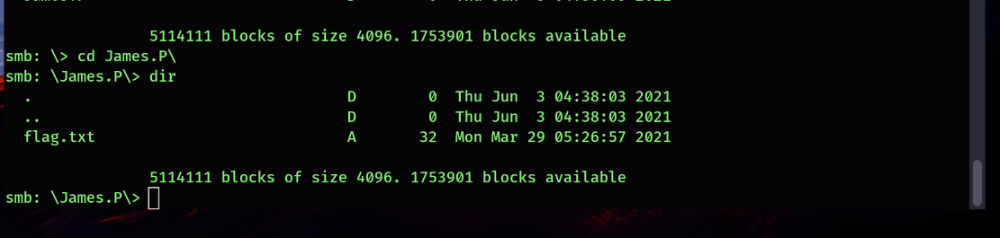

# Dancing — Windows SMB Share Assessment

A screenshot-backed walkthrough of an authorized Hack The Box lab. I enumerated a Windows host, tested SMB access, and found a readable shared folder containing the lab flag file. The evidence shows the **location** of `flag.txt`; it does not show its contents or a submitted flag.

| Field | Result |
| --- | --- |
| Target | Dancing, `10.129.1.12` (lab address) |
| Platform | Hack The Box |
| Tools | Kali Linux, ping, Nmap, smbclient |
| Date | September 25, 2026 (EDT) |
| Documented time to locate flag file | **15 min 58 sec**, from 12:01:28 to 12:17:26 screenshot timestamps |
| Finding | `WorkShares` allowed browsing and at least one file download with no password supplied |

> **Timing note:** The observed window begins with the first connectivity screenshot and ends when the flag filename appears. It does not measure machine spawn to flag submission.

## Objective

Find the intended access path by discovering services and checking effective share permissions. I recorded what each command actually proved, including script errors and failed attempts.

## 1. Check connectivity

```bash
ping -c 4 10.129.1.12
```

The target answered all four ICMP requests (0% packet loss). This established reachability from my Kali lab system; ICMP alone says nothing about which services are usable.



## 2. Discover services

```bash
nmap -sV 10.129.1.12 -vv
```

Nmap reported a Windows host with four open TCP ports:

| Port | Service reported | How I interpreted it |
| --- | --- | --- |
| 135 | Microsoft Windows RPC | Remote procedure call endpoint mapping |
| 139 | NetBIOS session | Windows sharing transport |
| 445 | Microsoft-DS / SMB | Direct SMB file sharing; a candidate for share enumeration |
| 5985 | Microsoft HTTPAPI | Common HTTP transport for WinRM; not necessarily a website |

The scan took 9.44 seconds. I tried port 5985 in a browser without finding a useful page. A browser result alone cannot tell whether WinRM would accept an authenticated client, so I followed the SMB evidence.



## 3. Inspect SMB behavior

I ran targeted Nmap SMB checks before trying a share connection:

```bash
nmap -sV -p445 10.129.1.12 --script=vuln -vv
nmap --script smb-vuln* -p 445,139 10.129.1.12 -vv
```

The security-mode output said **SMB signing enabled but not required**. A separate protocol check reported SMB 2.0.2, 2.1, 3.0, 3.0.2, and 3.1.1. Some vulnerability checks could not connect or negotiate, and the Conficker checks returned 0/4 positive with timeouts. I did **not** treat those incomplete checks as proof the system was free of vulnerabilities.

SMB signing is relevant to certain relay scenarios, but I did not attempt a relay. The access path in this lab was a share permission issue.



## 4. List shares, then test access

```bash
smbclient -L //10.129.1.12//
```

At the password prompt I submitted an empty response. The client listed `ADMIN$`, `C$`, `IPC$`, and `WorkShares`. The later SMB1 workgroup lookup failed **after** the share list succeeded. Seeing administrative share names did not establish that I could open them.



```bash
smbclient //10.129.1.12/WorkShares
# At the password prompt, submit an empty response.
# Then, within smbclient:
dir
```

The connection succeeded and `dir` listed `Amy.J` and `James.P`. This was stronger evidence than the share list: it showed that the server permitted browsing of `WorkShares` without a password being supplied. The screenshots do not identify whether the server mapped the session to guest, anonymous, or another account.



## 5. Follow the accessible directories

Within `smbclient`, I listed `Amy.J` and downloaded its 94-byte `worknotes.txt`:

```text
cd Amy.J
dir
get worknotes.txt
```

The file contents were not supplied for this write-up. The successful `get` demonstrates that at least one file was readable and downloadable.



I then navigated to `James.P` and found a 32-byte `flag.txt` (the intermediate `cd ..` is the navigation step, not independently shown in the screenshots):

```text
cd ..
cd James.P
dir
```

The screenshot shows the filename, not a `get flag.txt` command or its contents. I therefore record the lab result as **flag file located**, with retrieval and submission unverified.



## Finding and impact

**Observed:** The `WorkShares` SMB share allowed a connection with no password supplied, directory browsing, and download of `Amy.J/worknotes.txt`. The `James.P` directory exposed the name of `flag.txt`.

**Risk:** In a real environment, similarly permissive share and filesystem access could disclose internal notes or sensitive files to any client that can reach the SMB service. The actual contents and business impact depend on the files present. This assessment did not demonstrate code execution or access to `ADMIN$` or `C$`.

**Root cause to verify:** Effective SMB share and NTFS permissions, plus the identity to which an empty-password session was mapped. The screenshots establish effective access but do not reveal the host's full configuration.

## Defensive recommendations

1. Require named users for shares that contain internal files; remove unintended guest access.
2. Review **both** SMB share permissions and NTFS permissions for each folder.
3. Restrict SMB reachability to trusted network segments and authorized clients.
4. Audit file access and retest permissions with a no-password, low-privilege client.
5. Assess requiring SMB signing separately; it was not the mechanism used to read this share.

## What I learned

- A port scan identifies candidates; a successful file operation confirms effective access.
- A share can appear in a listing even when its contents remain protected. Test the specific share.
- An empty-password prompt is evidence of access without a supplied password; it does not reveal the server-side account mapping.
- Incomplete vulnerability scripts are not a substitute for testing the actual access controls.
- Keep the exact command, its result, and the time together so a reviewer can verify each conclusion.

## Evidence and publication notes

The seven screenshots in `evidence/` support the timeline and findings above. The documented discovery window is based on their original capture timestamps, **12:01:28–12:17:26 EDT**. This repository does not contain a live flag value, credentials, or the downloaded `worknotes.txt`.

This project documents an authorized training machine; the defensive recommendations are general and should be validated against a real system's configuration.
